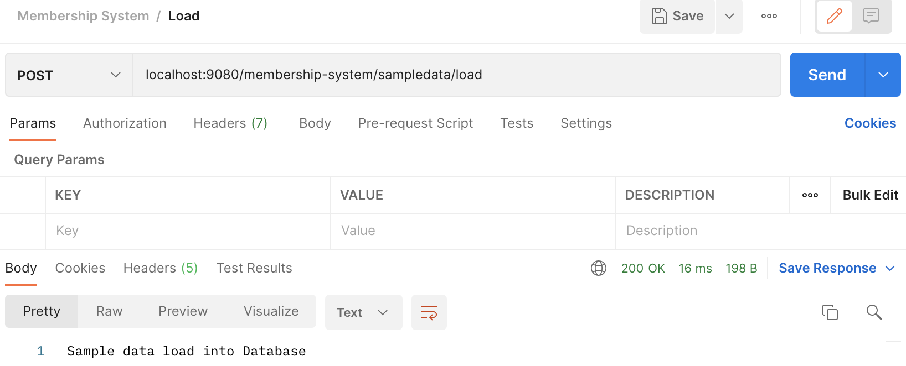
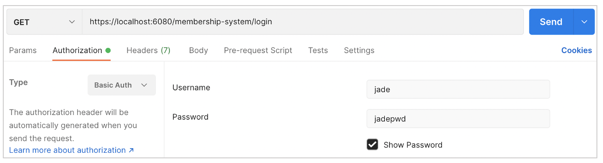
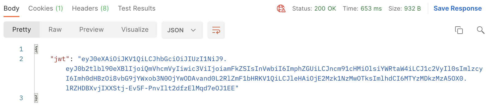
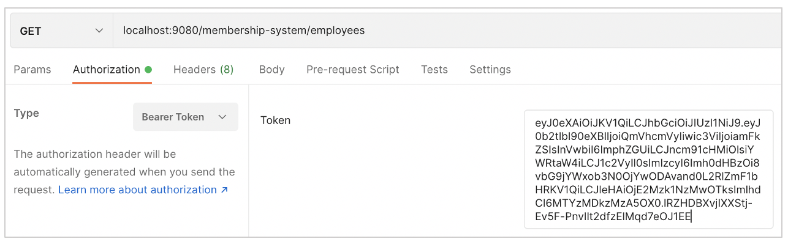

# Membership System
This repository contains the code for the Membership System. 

## User instructions
Prerequisites:
-	Command line knowledge
-	Java
-	Maven
-   Postman
-	Git (optional)

To build the application and deploy it to Open Liberty, please follow the instructions below:

1. If you haven't already downloaded the source code, clone this Github repository to your machine. Use your Terminal to navigate to the directory you want to place the repo, and run the command 
    ```sh
    git clone https://github.com/jadecarino/membership-system.git
    ```

2. Navigate to the root of the repository, using the command
    ```sh
    cd Synoptic\ Project\ Membership\ System
    ```

3. Navigate to the `login` directory and deploy the Login API to Open Liberty, using the commands
    ```sh
    cd login
    mvn liberty:run
    ```

4. Open another command line session and navigate to the `membership-system` directory and deploy the Membership System to Open Liberty, using the commands
    ```sh
    cd membership-system
    mvn liberty:run
    ```

After you see the following message in both command line sessions, both of your servers are ready:
```sh
The defaultServer server is ready to run a smarter planet.
```

You will have two Open Liberty server instances: the web application 'login' will be available on https://localhost:6080/membership-system/ and the web application 'membership-system' will be available on http://localhost:9080/membership-system/


Now, you can use Postman to test out the application. If you don't already have a Postman account, please login using this temporary account and press the button to fork and use the collection: 

| Email | Password |
|----------|----------|
| synopticprojecttemp@gmail.com | Firebrand123  |

[](https://app.getpostman.com/run-collection/15899001-aaa15db3-9cec-44a6-86a1-c4aaacfbcaa1?action=collection%2Ffork&collection-url=entityId%3D15899001-aaa15db3-9cec-44a6-86a1-c4aaacfbcaa1%26entityType%3Dcollection%26workspaceId%3D8432e8fd-7e6c-4072-8615-65887d41d744)


5. As the database will be empty, to load some sample data into the database, use the Sample Data request [http://localhost:9080/membership-system/sampledata/load](http://localhost:9080/membership-system/sampledata/load). This request requires no authentication as it is not part of the Membership System, just a helpful way to load data in to test the application. It will enter three Employee records into the database and open Accounts for them.



6. You will need to authenticate all other requests on the Membership System with a Json Web Token. Use the Login API [https://localhost:6080/membership-system/login](https://localhost:6080/membership-system/login) to login with any of the credentials below and get a Json Web Token:

| Username | Password | Role        | 
|----------|----------|-------------|
| jade     | jadepwd  | admin, user |
| frank    | frankpwd | user        |
| lydia    | lydiapwd | user        |



7. Copy the Json Web Token from the response (excluding the quotation marks) to your clipboard. You can now paste it into the Bearer token of all other requests on the Membership System to authenticate them. 





8. Use the Get all employees request [http://localhost:9080/membership-system/employees](http://localhost:9080/membership-system/employees) to view the sample data that was just loaded into the system.

9. Use any of the other requests in the Postman collection: view information about an individual employee, update their details, create a new employee, view an employee’s account balance using their card number, top up their balance or pay for an item.

10. To stop the servers, press CTRL+C in the Terminal session where the server is.

Thanks for using my application!