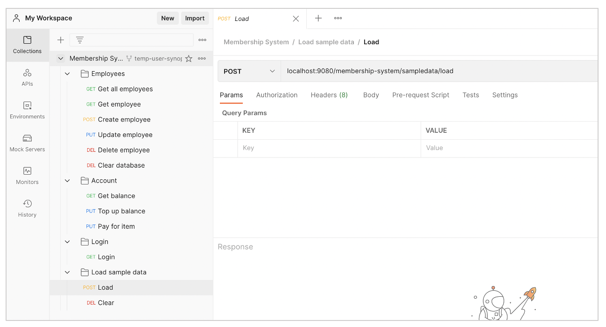
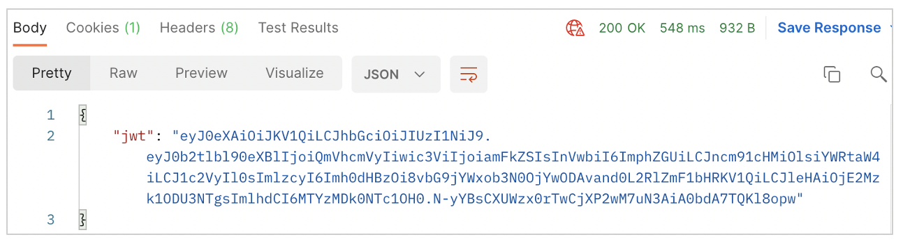

# Membership System
This repository contains the code for the Membership System. 

## User instructions
Prerequisites:
-	Command line knowledge
-	Java
-	Maven
-   Postman
-	Git

To build the application and deploy it to Open Liberty, please follow the instructions below:

1. Clone this Github repository to your machine. Use your Terminal to navigate to your Desktop, and run the command 
    ```sh
    git clone https://github.com/jadecarino/membership-system.git
    ```

2. Navigate to your Desktop. Once you are in your Desktop, run this command to navigate to the root of the repository
    ```sh
    cd Synoptic\ Project\ Membership\ System/
    ```

3. Navigate to the `login` directory and deploy the Login API to Open Liberty, using the commands
    ```sh
    cd login
    mvn liberty:run
    ```

4. Open another command line session and navigate to the `membership-system` directory and deploy the Membership System to Open Liberty, using the commands
    ```sh
    cd membership-system
    mvn liberty:run
    ```

The first time running the servers may take several minutes. After you see the following message in both command line sessions, both of your servers are ready:
```sh
The defaultServer server is ready to run a smarter planet.
```

You will have two Open Liberty server instances: the web application 'login' will be available on https://localhost:6080/membership-system/ and the web application 'membership-system' will be available on http://localhost:9080/membership-system/


### Postman 

Now, you can use Postman to test out the application. 

**IMPORTANT: if you are using the Postman web client, you will need to download the Postman Desktop Agent.**

Press the button below to fork and use the collection: 

[](https://app.getpostman.com/run-collection/15899001-aaa15db3-9cec-44a6-86a1-c4aaacfbcaa1?action=collection%2Ffork&collection-url=entityId%3D15899001-aaa15db3-9cec-44a6-86a1-c4aaacfbcaa1%26entityType%3Dcollection%26workspaceId%3D8432e8fd-7e6c-4072-8615-65887d41d744)

If you don't already have a Postman account, please login using this temporary account.

| Email                         | Password      |
|-------------------------------|---------------|
| synopticprojecttemp@gmail.com | Firebrand123  |

Fork the collection and save it to a Workspace.


<!-- 
 -->

Expand all of the folders inside the Membership System collection to see all of the requests.


1. As the database will be empty, to load some sample data into the database, use the **Load** request in the Load sample data folder. This request requires no authentication as it is not part of the Membership System, just a helpful way to load data in to test the application. It will enter three Employee records into the database and open Accounts for them.



2. You will need to authenticate all other requests on the Membership System with a Json Web Token, as I have secured the application. Use the **Login** request in the Login folder to login with any of the credentials below and get a Json Web Token back:

| Username | Password | Role        | 
|----------|----------|-------------|
| jade     | jadepwd  | admin, user |
| frank    | frankpwd | user        |
| lydia    | lydiapwd | user        |


**IMPORTANT: The following requests are restricted to just Admins (jade), so if you try to access them as a User (frank or lydia), you will get a 401 Unauthorized.**
- Get all employees
- Delete all employees

3. Copy the Json Web Token from the response (excluding the quotation marks) to your clipboard. You can now paste it into the Bearer token of all other requests on the Membership System to authenticate them. 




4. Use the **Get all employees** request in the Employees folder to view the sample data that was just loaded into the system.

5. Use any of the other requests in the Postman collection: view information about an individual employee, update their details, create a new employee, view an employee’s account balance using their card number, top up their balance or pay for an item.

The requests require a mix of path and query parameters. I have left placeholders in the requests to make it easier to write them.
- Path parameters are for identifying a resource
- Query parameters are for entering information

**Example:**
If you want to update an employee whose Employee ID is '5678', and you want to update their Name to 'Bob', Phone number to '07100200300', Email address to 'bob@email.com', Company to 'Github' and Card number to '1234', you identify them using a path parameter and enter the update information as query parameters:

```sh
localhost:9080/membership-system/employees/{employeeId}?name={name}&phoneNumber={phoneNumber}&emailAddress={emailAddress}&company={company}&cardNumber={cardNumber}
```
```sh
localhost:9080/membership-system/employees/5678?name=Bob&phoneNumber=07100200300&emailAddress=bob@email.com&company=Github&cardNumber=1234
```

6. To stop the servers, press CTRL+C in the command line session where the server is.

Thanks for using my application!